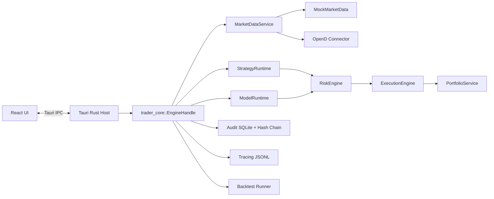

# Architecture

This repo implements a **paper-first**, cross-platform desktop trading workstation for **Futu OpenAPI / OpenD**.  
Primary safety rule: when uncertainty is detected, the engine prefers safer behavior (reject, cancel, halt).

## Stack

- Desktop shell: **Tauri v2** (`apps/desktop`, `apps/desktop/src-tauri`)
- UI: **React + TypeScript + Vite**
- Trading engine: **Rust** (`crates/core`)
- Connector: **Rust OpenD protocol client** (`packages/connectors/futu`)
- Strategy plugins: **Rust built-ins + Rhai sandbox scripting** (`packages/strategies`)
- Model plugins: **Rust built-ins + ONNX (tract-onnx) evaluator** (`packages/models`)
- Shared contracts:
  - Rust: `crates/shared`
  - TypeScript/Zod: `packages/shared`
- Storage:
  - JSON config (`config.json`, non-secrets)
  - SQLite (`db/trade_robot.sqlite`) for audit + registries
  - JSONL logs (`logs/trade_robot.jsonl`)
  - Backtest/model reports (`backtests/`, `model_evals/`)

## Repo Layout

- `apps/desktop`: React UI
- `apps/desktop/src-tauri`: Tauri host, IPC commands, global hotkey
- `crates/core`: engine modules (risk, execution, backtest, audit, persistence, live reconciliation)
- `crates/shared`: Rust domain contracts
- `packages/connectors/futu`: OpenD connector + mock market data + mock OpenD integration tests
- `packages/strategies`: built-in strategies and Rhai sandbox strategy
- `packages/models`: built-in model plugins
- `packages/shared`: TS schemas/types for IPC and UI
- `docs`: architecture, ADR, threat model, runbook, development

## High-Level Data Flow

## Runtime Modes

- `paper`: default; mock feed + paper execution.
- `research`: paper-safe; intended for backtest/research workflows.
- `live`: OpenD quote/order/account integration; locked until explicit unlock workflow completes.

## Key Modules

### MarketDataService

- Maintains watchlist subscriptions.
- Paper/research: uses deterministic mock quote stream.
- Live: connects to OpenD, subscribes quotes/KL, merges push + pull snapshots.
- Backpressure-safe: bounded channels, lag notices emitted as info events.

### StrategyRuntime

- Built-in strategies: MA crossover, mean reversion.
- Custom script strategy: Rhai sandbox with limits (ops, call depth, expr depth, string size).
- Custom scripts are blocked in `live` profile.
- Emits `SignalFired` events with trace IDs and reasons (explainability).

### ModelRuntime

- Built-in model catalog and parameter validation.
- Model registry persisted in SQLite with version/checksum metadata.
- ONNX evaluation contract for current offline evaluator:
  - input: float tensor `[1, 3]` = `[ret1, sma_delta, zscore]`
  - output: scalar score from first element of output tensor

### RiskEngine

- Pre-trade checks:
  - live unlock gate
  - kill switch / halted state gate
  - symbol allowlist
  - allowed market prefix list
  - max order size / max position size
  - rate limit (orders/min)
  - limit-price sanity band
  - time controls (sessions, blackout windows, per-symbol cooldown)
  - long-only safety in current MVP
- Post-trade/live monitoring:
  - daily loss breaker
  - quote staleness breaker

### ExecutionEngine

- Paper execution: simulated fills from quote stream.
- Live execution:
  - OpenD route for place/cancel/query
  - idempotency by `client_order_id`
  - reconciliation loop refreshes orders/positions/funds
  - kill-switch best-effort cancels open live orders

### Persistence + Audit

- Audit is append-only in SQLite with `prev_hash -> hash` chain.
- Strategy definitions, model registry, and model evaluations persist in SQLite.
- Backtest/model evaluations export JSON + HTML reports with config snapshot context.

## Safety and Reliability Controls

- Default mode is paper.
- Live enable workflow requires:
  - confirmation phrase
  - non-default risk limits
  - configured kill-switch hotkey
  - OpenD `real` trade env
  - keychain secret `futu.trade_password`
  - dry-run connectivity/global-state check
  - OpenD trade unlock call
- Kill switch:
  - UI action + global hotkey
  - stops strategies
  - blocks new orders
  - cancels paper/live open orders (best effort)
  - halts engine
- Safe mode:
  - crash marker on startup, cleared on clean exit
  - if previous run crashed, engine starts halted and live connect is blocked

## Observability

- Structured logs (JSONL via `tracing`).
- Engine metrics in snapshot:
  - quote updates
  - candles built
  - orders placed/rejected
  - fills
- Trace IDs recorded across strategy signals, order attempts, and audit events.

## Build Reproducibility

- Pinned Rust toolchain (`rust-toolchain.toml`)
- Locked Rust deps (`Cargo.lock`)
- Locked JS deps (`pnpm-lock.yaml`)
- CI builds and bundle workflows in `.github/workflows/`
